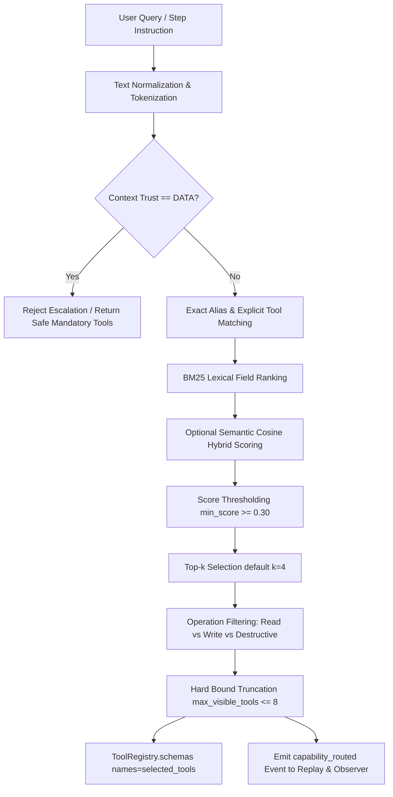

# M24 — Capability Discovery & Tool Routing

## Overview

As an agent runtime scales to dozens or hundreds of tools, exposing the entire tool catalog to every model turn causes severe context bloat, degrades reasoning latency, increases inference costs, and increases the surface area for tool confusion and hallucinations.

**M24 Capability Discovery & Tool Routing** introduces an intelligent, deterministic routing layer that projects a bounded, highly relevant subset of tool schemas per model turn while strictly preserving repository security and authorization invariants.

---

## Core Invariants

### 1. Separation of Routing and Authorization
> **Capability Routing answers:** *"Which tools should the model be shown?"*  
> **Trust Kernel answers:** *"May this concrete action execute?"*

These two responsibilities are strictly orthogonal:
- **Never:** `Capability Router -> authorization`.
- A tool hidden by Capability Routing is not projected into the model's schema window for that turn.
- A tool selected by Capability Routing is **NOT** pre-authorized. Any subsequent tool execution (e.g. `run_command`, `filesystem_write`) must still pass through the Trust Kernel, approval policies, idempotency checks, and Action Ledger.

### 2. Zero-Tool Invariant for Verification & Governance Roles
Evaluation, judgment, and contract-building roles must remain strictly tool-free. Capability Routing explicitly maintains:
- `DeterministicGoalVerifier`: `tools=[]`
- `ModelGoalJudge`: `tools=[]`
- `DeterministicGoalContractBuilder`: `tools=[]`
- `ModelPlanReviewer`: `tools=[]`
- `LayeredTaskVerifier`: `tools=[]`

### 3. Safe Fallback Policy (No Full Catalog Leakage)
A routing miss (when a user query does not strongly match any registered capabilities or represents an informational/factual question) must **never** fall back to exposing the complete tool catalog.
- If a query fails to match capabilities above the minimum threshold (`min_score`), the router exposes only mandatory safe tools or zero tools (`selected_tools=()`).

### 4. Context Firewall DATA Defense
Untrusted data (such as malicious prompts embedded in repository files, markdown notes, or tool execution outputs) marked with `ContextTrust.DATA` cannot command the router or trigger explicit capability privilege escalation. Explicit tool references from `ContextTrust.DATA` are rejected by default.

---

## Architecture & Routing Pipeline

The capability router follows a multi-stage deterministic pipeline:



### Pipeline Steps:

1. **Discovery & Catalog Building (`tieru/capabilities/catalog.py`)**:
   - Discovers all tools on `ToolRegistry`.
   - Groups tools into canonical capability blueprints: `coding_execution`, `calendar`, `messaging`, `notes`, `search`, `weather`, `filesystem`, `repository`, `delegation`, `memory_recall`, `memory_admin`, `scheduler`, `browser`.
   - Generates fallback capabilities (`tool.<name>`) for unmapped tools (including dynamic MCP tools).
2. **Text Normalization & Operation Detection (`tieru/capabilities/retrieval.py`)**:
   - Cleans and normalizes tokens without lossy English stemming.
   - Filters common English stopwords (`and`, `the`, `of`, `to`, `in`, `for`, `with`, etc.).
   - Classifies intended operations (`read`, `create`, `update`, `delete`, `execute`).
   - Gated destructive intent detection (`delete`, `remove`, `cancel`, `drop`, `destroy`, `clear`, `wipe`, `purge`).
3. **Multi-Stage Scoring (`tieru/capabilities/router.py`)**:
   - **Explicit Match**: Queries explicitly citing a tool name or exact capability alias score 0.95–1.0.
   - **BM25 Lexical Scoring**: Calibrated term-frequency / inverse-document-frequency across capability names (weight 4.0), aliases (weight 3.0), keywords (weight 2.0), domains (weight 1.1), and descriptions (weight 1.0).
   - **Semantic Cosine Scoring**: Optional embedding-based cosine similarity cached in SQLite by metadata content hash.
4. **Operation & Destructive Filtering**:
   - Pure read queries hide mutating write tools (e.g., `list_events` is shown, but `create_event` is excluded).
   - Destructive tools (e.g., `cancel_schedule`) are hidden unless explicit destructive intent is present.
5. **Hard Max Truncation**:
   - Enforces `max_visible_tools: int = 8` to prevent token bloat regardless of catalog size.
6. **Schema Projection (`ToolRegistry.schemas(names=...)`)**:
   - Returns OpenAI/Anthropic tool schemas strictly for `selected_tools`.
   - Preserves `ToolRegistry.execute()` and Trust Kernel authorization for all tools.
7. **Observability & Replay**:
   - Emits `capability_routed` events into `ReplayService` and observers with candidate count, selected capabilities, scores, and truncation flags.

---

## CLI Usage

Inspect and test capability routing directly from the command line:

```bash
# Human-readable output
tieru capability route "What meetings do I have tomorrow?"

# JSON output
tieru capability route "Inspect repository and run tests" --json
```

Example JSON output:
```json
{
  "query": "Inspect repository and run tests",
  "candidate_tool_count": 25,
  "truncated": false,
  "selected_capabilities": [
    {
      "capability_id": "coding_execution",
      "score": 0.95,
      "reason": "exact_alias",
      "tool_names": ["shell_run"]
    },
    {
      "capability_id": "repository",
      "score": 0.95,
      "reason": "exact_alias",
      "tool_names": ["git_status", "git_diff", "git_log", "code_search", "code_read", "code_patch"]
    }
  ],
  "selected_tools": [
    "shell_run",
    "git_status",
    "git_diff",
    "git_log",
    "code_search",
    "code_read",
    "code_patch"
  ]
}
```

---

## Evaluation & Metrics

M24 integrates directly into the Tieru deterministic evaluation harness (`tieru/evals/`):

### Scorecard Metrics:
- **`capability_required_tool_recall`**: Recall of expected tools across tasks ($\ge 0.95$, achieved $1.0$).
- **`capability_forbidden_tool_exclusion`**: Exclusion rate of forbidden/irrelevant tools ($\ge 0.95$, achieved $1.0$).
- **`capability_no_tool_accuracy`**: Accuracy of exposing 0 non-mandatory tools on factual queries ($1.0$).
- **`average_visible_tools`**: Average tool count exposed to the model per turn ($\approx 1.1$–$1.9$, well within bounds).
- **`tool_schema_reduction_rate`**: Percentage reduction in tool schemas sent to the model ($> 0.90$, achieved $92.29\%$).
- **`required_tool_hidden_rate`**: Rate at which a required tool was accidentally hidden ($0.0\%$).

### Corpus Cases (`evals/cases/capability_routing.json`):
- **Case A**: Coding task (`Inspect repository and run tests`) -> Coding tools visible, calendar/messages hidden.
- **Case B**: Calendar read (`What meetings do I have tomorrow?`) -> `list_events` visible, `create_event` hidden.
- **Case C**: Calendar creation (`Schedule a meeting tomorrow at 9am`) -> `create_event` & `list_events` visible.
- **Case D**: Memory recall (`What did I tell you about project X?`) -> `memory_query` visible, admin tools hidden.
- **Case E**: No-tool factual query (`Explain idempotency`) -> 0 non-mandatory tools visible.
- **Case F**: Explicit user capability -> Selected with Trust Kernel check still applied.
- **Case G**: Malicious DATA injection -> Prompt injection in data cannot escalate router privilege.
- **Case H**: Destructive intent -> Cancellation capability visible; unrelated destructive tools hidden.
- **Case I**: M22 replanned step -> Newly relevant tools routed per replacement step.
- **Case J**: Goal Verifier -> Evaluator remains strictly zero-tool (`tools=[]`).
