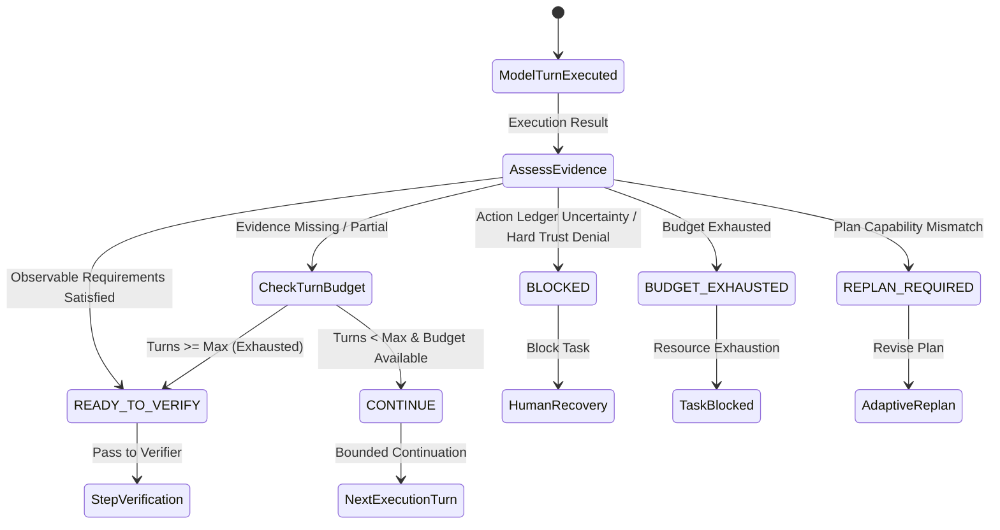

# Step Completion Controller & Evidence Realization

Tieru M30 establishes runtime ownership over Durable Task step execution and verification progression. The assistant or language model may propose candidate outputs and request tool invocations, but the production runtime uniquely controls whether a step is complete.

---

## 1. Core Architectural Principle

> **A language-model turn ending does not imply that a Durable Task step is complete.**

A model response terminating with `finish_reason: "stop"` (or `finish_reason: "end_turn"`), or an assistant message asserting that work is done (e.g., `"The file has been created and verified"`), is merely a candidate proposal. It does not transition a Durable Task step to completion or verification.

> **Tieru advances a tool-required step toward verification only after runtime-observable evidence requirements are satisfied.**

> **Step continuation is bounded and consumes the Durable Task Resource Budget.**

> **The Step Completion Controller cannot authorize actions, expose hidden tools, or mark verification as successful.**

> **Uncertain external execution always requires Human Recovery.**

---

## 2. Invariants

1. **Deterministic Production Ownership**: No secondary LLM agent (e.g., manager agent, supervisor agent, critic agent) is used to judge step completion. Decision logic is deterministic, deterministic-rule-driven, auditable, and bounded.
2. **Observable Evidence Realization**: Tool-required steps (`read`, `write`, `command`, `external_action`, `mixed`) must produce observable execution evidence (exit codes, mutated artifacts, verifiable ledger entries) matching the step's contract before progressing.
3. **Bounded Continuation Turns**: If observable evidence is absent or partial, the runtime initiates a continuation turn on the same step up to `limits.max_execution_turns_per_step` (default: 3).
4. **Strict Budget Accounting**: Every continuation turn consumes `BudgetResource.MODEL_CALLS` and `BudgetResource.RETRIES`. If budget is exhausted, continuation halts safely and transfers to deterministic verification failure.
5. **No Secret Leakage**: Continuation prompts and state feedback pass through secret redaction (`tieru.memory.personal.redact_secrets`) before being surfaced to the model.
6. **Preservation of Pre-Goal Multi-Step Progress**: If a step successfully passes and model call budget is insufficient to run optional LLM plan review, the runtime preserves the existing plan rather than terminating the task prematurely.

---

## 3. State Transitions & Controller Decisions

The `StepCompletionController` assesses the step and produces one of five mutually exclusive decisions:



### Assessment Precedence Matrix

| Decision | Trigger Condition | Consequence |
|---|---|---|
| `BLOCKED` | `tool_execution_uncertain` or `tool_permission_denied` | Halts step execution immediately. Unresolved external execution requires Human Recovery. |
| `BUDGET_EXHAUSTED` | Budget exhaustion detected in tool execution or error codes | Halts step execution. Marks budget resource exhausted. |
| `REPLAN_REQUIRED` | Required tool capability missing from `visible_tools` | Routes step to adaptive replanning rather than wasting turns. |
| `READY_TO_VERIFY` | All required observable evidence produced OR substantive reasoning answer | Hands execution record to `DeterministicStepVerifier` / `LayeredTaskVerifier`. |
| `CONTINUE` | Observable evidence missing/partial, turns remaining < limit, budget available | Re-prompts model with objective, missing requirements, and satisfied requirements. |

---

## 4. Comparison Matrix: Model-Claimed vs Runtime-Owned

| Scenario | Model Prose Claim | Observable Execution State | Legacy Behavior (M26–M28) | M30 Runtime Controller |
|---|---|---|---|---|
| **File Read Step** | "I read data.json and found..." | No tool executed (`tool_calls == ()`) | Proceeded to verification; false failure or semantic hallucination | Controller issues `CONTINUE`, prompting model to invoke `filesystem_read` |
| **File Edit Step** | "Fixed the bug in math_lib.py" | No file write executed | Proceeded to verifier; verifier reported missing evidence | Controller issues `CONTINUE`, prompting model to invoke `filesystem_write` |
| **Test Execution** | "Ran pytest, 5 passed" | No command executed | Step marked pass if verifier semantic, or fail | Controller issues `CONTINUE`, prompting model to invoke `run_command` |
| **Test Execution** | "Ran pytest" | Command returned exit code 1 | Model claims success in text | Controller detects non-zero exit code, issues `CONTINUE` |
| **Action Uncertainty** | "Transferred funds" | Network timeout, ledger indeterminate | Continued blindly | Controller issues `BLOCKED` for Human Recovery |
| **Turn End** | `finish_reason: "stop"` | Step requires `artifact_changed` | Step closed | Step remains open; bounded continuation requested |

---

## 5. Continuation Prompt Specification

When `StepContinuationDecision.CONTINUE` is determined, the controller formats a prompt adhering to DATA/CONTROL boundary isolation:

```text
[STEP EXECUTION CONTINUATION]
The current Durable Task step requires additional observable evidence before it can transition to verification.
Step: 2. Fix Subtraction Bug
Objective: Update math_lib.py to return a - b instead of a + b.

Already satisfied evidence:
- [tool_success] Inspected math_lib.py with filesystem_read

Missing required evidence:
- [artifact_changed] Modify math_lib.py using a file-writing tool (e.g. filesystem_write)

DIRECTIVE:
1. Stay on this current step. Do not begin subsequent steps.
2. Invoke the necessary tool to produce the missing observable evidence.
3. Do not simply describe completion in text; the runtime requires real tool execution.
```

---

## 6. Telemetry & Metric Ledger

The following metrics track realization and continuation performance:

- `expected_pass_cases`: Count of benchmark cases expected to complete without policy denial.
- `expected_pass_completion_rate`: Rate of expected-PASS cases achieving successful completion.
- `evidence_realization_rate`: Satisfied requirements / total requirements.
- `execution_contract_completion_rate`: Proportion of steps satisfying their contract without exhaustion.
- `early_model_termination_rate`: Rate of turns where model stopped before producing required evidence.
- `continuation_turn_rate`: Proportion of cases requiring multi-turn execution within steps.
- `continuation_success_rate`: Proportion of continuation sequences resulting in verified steps.
- `average_execution_turns_per_step`: Mean number of execution turns per durable step.
