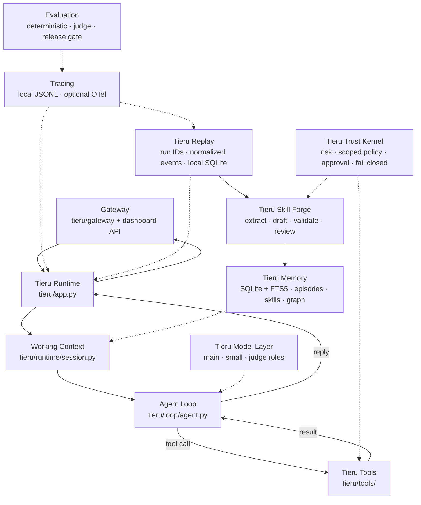

# Tieru runtime architecture

Tieru is a local-first personal AI runtime. The architecture is deliberately
split into a small execution path and supporting systems that can be inspected,
configured, or replaced without redefining the product around one model.

This document describes shipped code. Future product names are identified as
planned and do not imply implementation.

## Runtime path

The request path is:

1. A gateway accepts text and delegates lifecycle work to **Tieru Runtime**.
2. The runtime assembles bounded **Working Context** from the editable persona,
   recent history, gated relevant memory, and matching skills.
3. The **Agent Loop** calls the selected model role until it returns a reply or
   reaches the iteration guard.
4. Tool requests pass through the central permission boundary before
   **Tieru Tools** execute them and return results to the loop.
5. The runtime persists the turn and emits trace events before returning the
   reply through the gateway.

## Shipped supporting systems

### Tieru Memory

Tieru Memory has four additive capabilities: semantic facts, episodic records,
procedural skills, and the **Tieru Memory Graph**. SQLite with FTS5 remains the
default local source of truth for text memory; graph entities and relations live
in the same `state.db`. Working context is rebuilt per turn and is not another
durable store. Retrieval is gated, long-term writes are explicit by default,
and optional consolidation is loss-safe.

The graph repository owns its SQL and exposes typed entities plus directed,
machine-readable relations. Relations retain provenance references, bounded
confidence and importance, temporal validity, lifecycle status, and optional
supersession linkage. Exact entity mentions are resolved locally and a depth-one
neighborhood is added before falling back to semantic retrieval. Both entity
and relation counts are hard-bounded; no model is called for graph traversal.
Normal conversations and existing memories are not automatically converted.
See [Memory Graph](MEMORY_GRAPH.md).

### Tieru Model Layer

Configuration assigns providers and model IDs to independent `main`, `small`,
and `judge` roles. Anthropic and OpenAI-compatible protocols are implemented;
Ollama is a keyless local provider target. `gemma4:e2b` is the verified local
profile, but no model is embedded in the loop's business logic.

### Tieru Model Fabric v2

The opt-in **Tieru Model Fabric v2** sits above `ModelRouter` and decides one
immutable execution strategy per turn. A deterministic-first analyzer produces
a bounded `TaskProfile`; policy selects QUICK, STANDARD, AGENT, or DEEP; and a
structured `RouteDecision` resolves its role/model/provider through the existing
router. The same Ollama `gemma4:e2b` backend can serve every mode.

Profiles control finite token, iteration, and history limits plus memory/tool
availability and optional DEEP verification. QUICK omits memory retrieval and
tool schemas. AGENT exposes tools without granting them. Trust remains the sole
authorization boundary. M12 adds a configuration-driven candidate registry,
lazy cached availability, privacy/capability hard filters, deterministic scoring,
Replay-backed performance after a minimum sample size, and bounded hard-failure
fallback before side effects. `ModelRouter.client_for` remains the adapter/client
construction authority. See [Model Fabric](MODEL_FABRIC.md).

### Tieru Capsule

`tieru/capsule/` is the offline portability boundary. Export reads explicit
allowlisted persona/config files, user skills, and structured rows from a
consistent SQLite read snapshot. It emits a versioned ZIP-compatible container
with stable paths and SHA-256 metadata. Import treats every member as untrusted,
validates bounds/paths/layout/hashes, creates an `ImportPlan`, then performs
additive transactional database writes and staged atomic file moves. Trust rules
remain inactive review artifacts and current local config wins conflicts. See
[Capsule](CAPSULE.md).

When Fabric is enabled it replaces optional graph triage as the top-level turn
decision; graph workflows remain available for explicit/internal orchestration.
When disabled, the pre-M11 graph/full-loop behavior remains unchanged. Cloud
participation requires explicit candidate configuration; local-only Ollama
remains a complete keyless deployment.

### Tieru Trust Kernel

Every model-requested tool action crosses one authorization boundary immediately
before execution. The registry converts legacy tool metadata and safe arguments
into an `ActionRequest`. The kernel normalizes canonical capabilities, assigns a
deterministic risk level, evaluates scoped policy, obtains a single-use human
approval when required, and returns a structured `TrustDecision`. A denial never
invokes the tool function.

Explicit deny outranks scoped allow, which outranks approval, capability/default
policy, and finally deny-by-default. Unknown capabilities, invalid policies,
classifier failures, unavailable or failing approval handlers, and invalid
targets fail closed. Action fingerprints contain only normalized safe identity
fields. Trust observer events contain decisions, not tool arguments.

MCP actions use the same boundary and remain unclassified/denied unless a user
adds local per-tool classification. Restricted Playwright retains its domain,
address, timeout, action-count, and isolated-context controls; the kernel also
rejects navigation outside configured domains before Playwright runs. See
[Trust Kernel](TRUST_KERNEL.md).

### Tieru Tools

Built-in tools cover local memory administration, skills, scheduling, message
drafting, search, and workspace operations. Optional tools and gateways remain
configuration-gated. MCP servers can add namespaced tools through `.tieru/mcp.json`.
The configured stdio process must first pass Trust as `process_execution`; each
result is redacted/bounded, and each discovered tool still passes through the
same permission registry.

### Tracing, Replay, and evaluation

Every run can emit ordered JSONL trace events locally, with optional
OpenTelemetry export. Deterministic tests verify observable outcomes; the
credentialed judge suite scores open-ended answers separately; the release gate
reports both honestly.

**Tieru Replay** is the structured local inspection layer over these observer
foundations. Every new turn receives a stable run ID and normalized,
sequence-ordered events in the existing SQLite database. It exposes bounded
memory/model/routing/Trust/tool/error/output metadata through a read-only CLI and
dashboard while excluding private chain-of-thought. JSONL and OTel remain
independent outputs. See [Replay](REPLAY.md).

### Tieru Skill Forge

**Tieru Skill Forge** is an explicit producer for procedural memory. It reads
one or more user-selected successful Replay runs, deterministically extracts a
bounded `WorkflowCandidate`, conservatively generalizes safe inputs, and writes
an inactive local draft. Optional synthesis uses the configured `small` role;
the deterministic template fallback needs no model, key, or network.

Deterministic validation and side-effect-free behavioral consistency evaluation
must pass before human review and explicit approval. The Trust Kernel governs
draft writes and collision-safe installation into `TIERU_HOME/skills`; the
existing `SkillLoader` remains the sole runtime consumer. Forge does not monitor
activity, detect repetition, replay side effects, or grant permissions. See
[Skill Forge](SKILL_FORGE.md).

### Tieru Shadow

**Tieru Shadow** is a disabled-by-default advisory layer over completed Replay
runs. After Replay safely completes, Shadow reuses Forge's eligibility checks,
`WorkflowExtractor`, and structural `workflow_signature`; it then updates a
bounded local aggregate. Exact signature equality, deterministic thresholds,
and deterministic confidence can produce an inspectable suggestion without a
model, network, key, or background worker.

Ignore, snooze, dismiss, compatible active-draft, and installed-skill checks
suppress duplicate prompts. An explicit Forge action passes at most three
representative Replay IDs into the unchanged M9 lifecycle and creates an
inactive draft only. Shadow cannot call tools, modify Memory or policy, approve
an action, install a skill, or make a normal response depend on its success.
See [Shadow](SHADOW.md).

## Optional graph workflows

`tieru/graph/` can arrange steps around the agent loop for work with explicit
fan-out, fan-in, or routing. It is opt-in. A graph's `agent_node` invokes the same
loop; graph workflows do not replace or redesign it, and they are not a
peer-to-peer multi-agent system.

## Local-first boundary

By default, runtime state is stored under `.tieru/`: SQLite memory, Replay, and
Shadow metadata tables; inactive Forge drafts; local calendar and outbox
artifacts; skills; traces; and usage records. Running all
model roles through Ollama keeps inference local. Network providers, cloud
memory backends, MCP servers, search, browser targets, and messaging/calendar
integrations cross the machine boundary only when explicitly configured and
permitted.

## Historical architecture artifacts

`docs/architecture.html` and `docs/whiteboards/waku-architecture.excalidraw` are
upstream-era architecture artifacts retained for provenance. Their Waku names,
paths, repository links, and authorship are historical evidence, not Tieru's
current product identity. Current architecture is defined by this document and
the shipped `tieru/` source tree.
